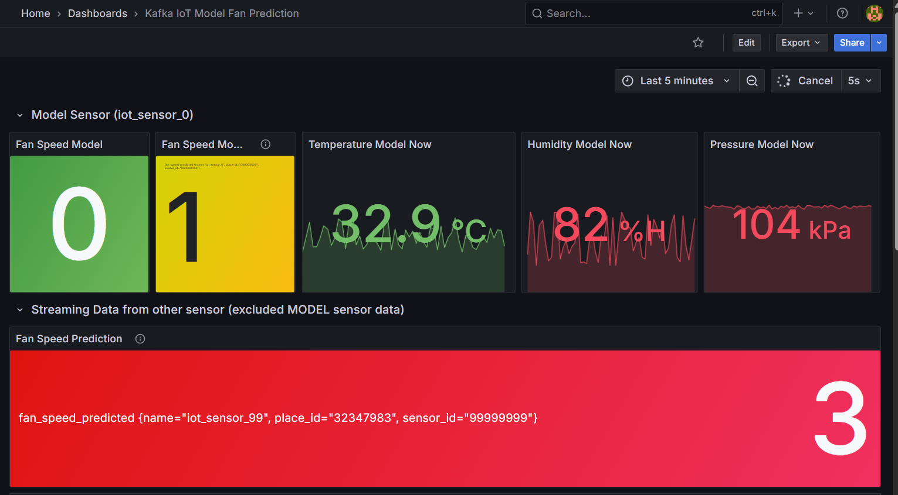

# Online Prediction

<!-- Online Prection ทำงานอย่างไร  -->

## ปิดการใช้งานของ Batch ML ดังนี้

1. train-from-data
2. predict-then-influxdb
3. kafka-to-jsonl

## เริ่มใช้งาน Online ML ดังนี้

1. docker compose down batch ML
2. แก้ .env
3. docker compose up Online ML

## ผลที่ได้จากการใช้ ML มีดังนี้

<!-- แนบรูป Grafana  พร้อมอธิบาย -->

เป็นภาพแสดงการทำนายของโมเดล fan prediction รวมไปถึงค่าต่างๆเช่น humidity temperature และกราฟแสดงค่าของแต่ละช่วงเวลาของแต่ละค่า
